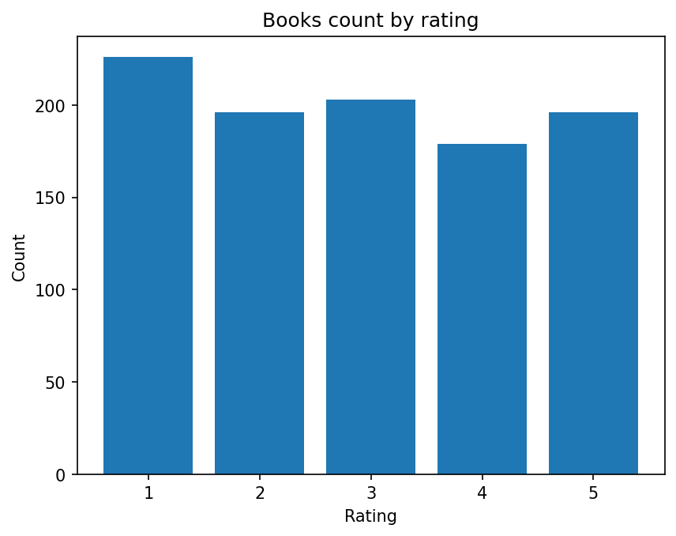
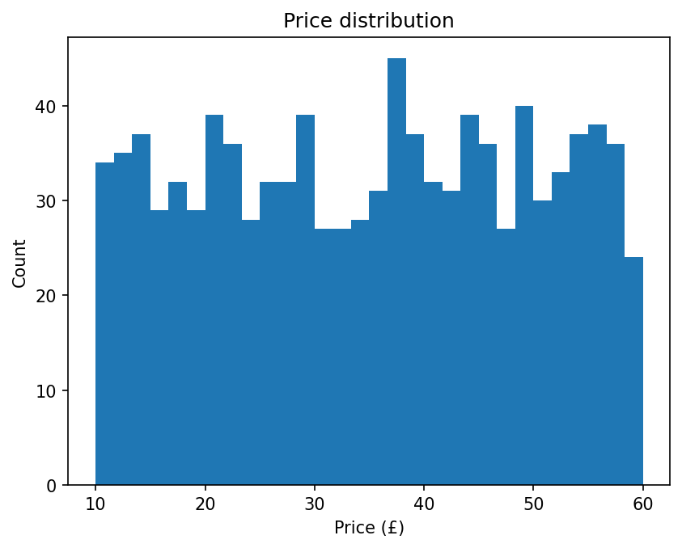

# Books Scraper (BeautifulSoup + SQLAlchemy)

A small web scraping project that collects book data from http://books.toscrape.com/ and stores it in a SQLite database.
It also generates simple visualizations from the stored data.

## What it does
- Scrapes all pages (up to ~1000 books)
- Extracts: title, price, rating, cover image url
- Saves data into SQLite using SQLAlchemy
- Builds charts:
  - books count by rating
  - price distribution

## Tech stack
Python, Poetry, Requests, BeautifulSoup4 (lxml), SQLAlchemy, SQLite, Matplotlib

## Project structure
- `main.py` — scraper + save to SQLite
- `model.py` — SQLAlchemy model
- `report.py` — charts from SQLite data

## Run
```bash
poetry install
poetry run python main.py
poetry run python report.py

## Visualizations


